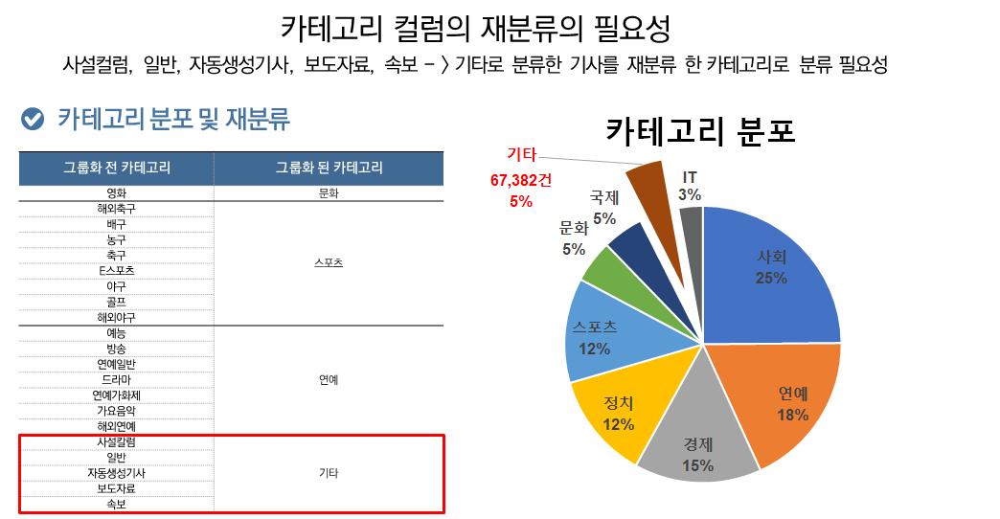
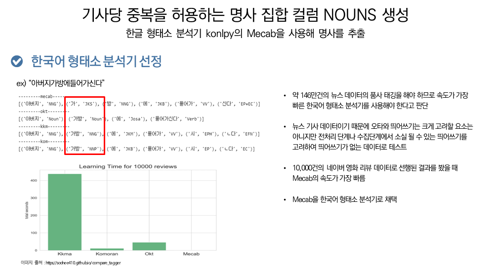
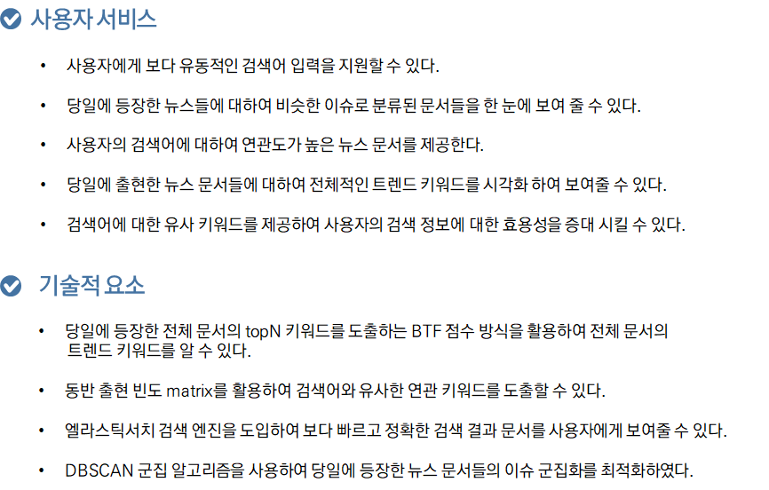

#  뉴스 데이터 자연어 처리를 통한 트렌드 분석 및 검색 서비스

팀원 :  김강현, 박주희, 윤민우, 윤세영

## 프로젝트 요약

### 1.  프로젝트 주제 

 *  뉴스 검색 엔진 구축과 키워드 Top N, 실시간 급상승 키워드 Top N 구현 
   

### 2.  주제 선정 배경

*  AI가 발전함에 따라 검색 엔진과 AI를 접목한 검색 엔진이 주목 받고 있습니다. 구글과 네이버도 이를 구현하고자 노력하고 있습니다. 이에 착안하여 뉴스 검색엔진의 역할과 딥러닝을 활용해 수집한 뉴스를 서비스에서 정한 주제로 재분류하고, 뉴스 주제들을 클러스터링하여 주제별로 그룹화된 뉴스를 제공하고, 다양한 시각화와 워드클라우드를 제공합니다. 

### 3.  프로젝트 개요
* 다음 뉴스(https://news.daum.net) 를 통해 뉴스데이터(매일 4500건)를 시간대로 균등하게 수집하고, 이를 영어기가 제거, 복수를 허용하는 명사 집합 NOUNS 컬럼 생성 등의 전처리 과정을 거쳐 DB에 적재, 이를 인덱스 방식 접근인 엘라스틱서치에 인덱스 등록 과정을 거쳐 웹에서 보다 빠르게 접근하고, 조회하여 제공합니다. 

* 최초 프로젝트설계에서는 스케줄링을 통한 DB적재와 전처리를 배치처리하고자 했으나 여러 기술적인 어려움때문에 2월 말에서 데이터 적재가 끝난 상황에서 프로젝트를 진행했습니다. 

* 분석된 데이터는 자바와 파이썬 flask를 통해 웹으로 구현 됩니다. DB는 Maria DB를 사용했습니다. 

### 4.  분석에 사용된 툴

|언어|분석 라이브러리|웹|데이터 분석|
|---|---|---|---|
|Python,Java,SQL|Pandas, Numpy, Sikit-Learn|,HTML5, JS, Ajax, CSS, Bootstrap|Pandas, Numpy, Sikit-Learn,Keras, Flask, BeautifulSoup, TensorFlow|

|개발 도구|데이터베이스|협업 툴|
|---|---|---|
|Python 3.7.11, VScode 1.63.2, Jupyter Notebook 6.3.0|Maria DB|Github&Git-Fork, Slack, Jira|

## 프로젝트 정보

### 1.  프로젝트 주제 

#### 뉴스 검색 엔진 구축과 키워드 Top N, 실시간 급상승 키워드 Top N 구현 

### 2.  주제 선정 배경 및 개요

   * 구글과 네이버는 최근 AI를 활용한 검색엔진구축에 힘쓰고있습니다. 
     본 프로젝트에서는 수집된 뉴스데이터를 엘라스틱 서치를 활용한 인덱스 조회 방식으로 빠르게 문서에 접근합니다. 
     그리고 뉴스 주제 군집화, 카테고리 분류 모델을 통해 다양한 시각화와 워드클라우드 등 대시보드를 제공합니다. 

### 3. 프로젝트 환경

   

 

### 4. 데이터 수집 및 EDA 

* 데이터는 다음 뉴스(https://news.daum.net) 를 통해 수집했습니다.
* 데이터 수집 범위는 2021.01.01~2022.02.28까지 매일 300페이지(4500건)를 시간대별로 균등하게 수집하였습니다.

#### 수집된 데이터의 ERD는 다음과 같습니다. 

* 수집된 뉴스 데이터의 카테고리는 다음과 같은 분포를 갖고 있습니다. 이를 팀 회의를 통해 그룹화를 먼저 진행했습니다.
* 하지만 사설컬럼, 일반 자동생성기사 등 다양한 주제를 갖고 있는 카테고리는 우리가 그룹화한 카테고리로 분류해야 된다고 판단했습니다.
* 따라서 기타로 분류한 기사를 분류하기 위한 모델을 생성했습니다.

### 5. 전처리

#### 수집된 데이터에서 수행한 전처리는 다음과 같습니다.

* 제목와 본문이 영어로 된 뉴스는 제외함.

* 다양한 뉴스 카테고리를 (사회, 연예, 경제, 정치, 스포츠, 문화, 국제, IT) 8개 카테고리로 그룹화함

### 6. 파생변수

* 자연어 처리를 위한 형태소 분석기는 본 프로젝트에서 크게 4개(mecab, okt, kkma, komoran)를 염두해 두고 비교했는데, 띄어쓰기가 없는 문장에서 좋은 성능을 보여주며, 속도에서도 가장 좋은 성능을 보인 mecab를 형태소 분석기로 채택하여 진행했습니다.

* 기사당 중복을 허용한 명사들의 집합인 NOUNS컬럼을 파생변수로 생성했습니다. 

### 7. 모델링

* 카테고리 분류를 위한 모델은 Bi-LSTM(양방향 LSTM)모형을 사용했습니다. Bi-LSTM모형은 순차적인 입력 값에 대해 이전 데이터와의 관계 분만 아니라 이후 데이터와의 관계까지도 학습하기 때문에 좋은 성능을 보일 것이라고 판단하여 해당 모형을 채택했습니다. 

### 8. 프로젝트 시연

   

### 9. 결론

### 10. 프로젝트 한계점 및 개선점

* 텍스트 점수 도출 과정에서 변형된 TF 점수 지표인 BTF 점수를 정규화하여 키워드 간 상대적 중요도를 반영하는 과정 필요

* 텍스트 연관어 분석 시 최신 뉴스 데이터 갱신에 따른 주기적인 Word2Vec 모델 훈련에 대한 연구 필요

* 데이터 적재작업 일 별 스케줄링을 통한 지속적인 웹 서비스 제공 방안 필요

* 뉴스 카테고리 분류 시 사용되는 모형을 LSTM이 아닌 BERT나 KoBERT 같은 성능이 좋은 모형도 적용해 볼 필요

